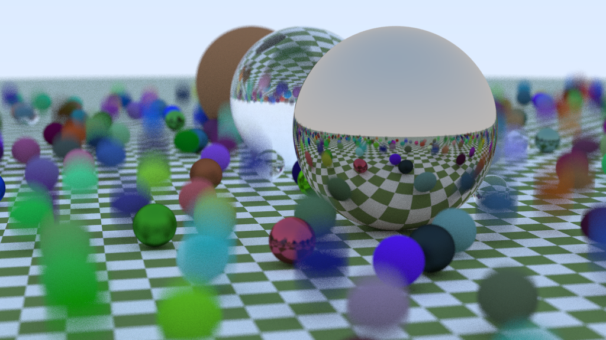

# Ray Tracing in One Weekend

A straightforward Rust implementation of the book
[_Ray Tracing in One Weekend_][rtow] by Peter Shirley.

[rtow]: https://raytracing.github.io/books/RayTracingInOneWeekend.html

## Features

This proof-of-concept ray tracer includes the following features:

* Lambertian diffuse shading
* Hemispherical scattering diffuse shading
* Metallic materials
* Dielectric materials, such as water and glass
* Depth-of-field blur effects

The architecture is currently in the MVP (minimum viable product) state. Further
features and improvements are forthcoming, some chosen from the "next steps"
self-guided exercises and others from the book's seminal sequel _Ray Tracing The
Next Week_.

## Results

